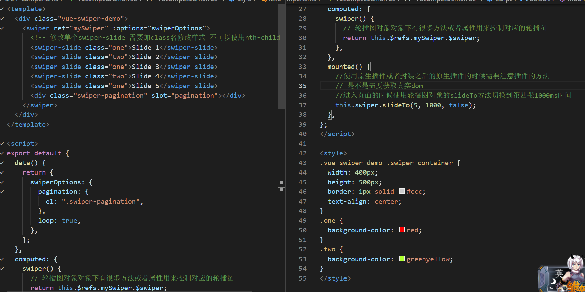
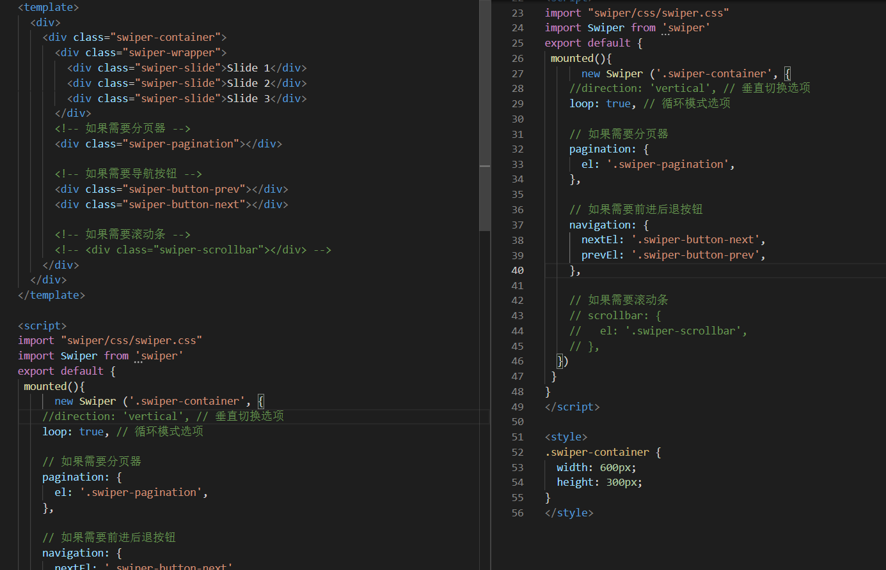
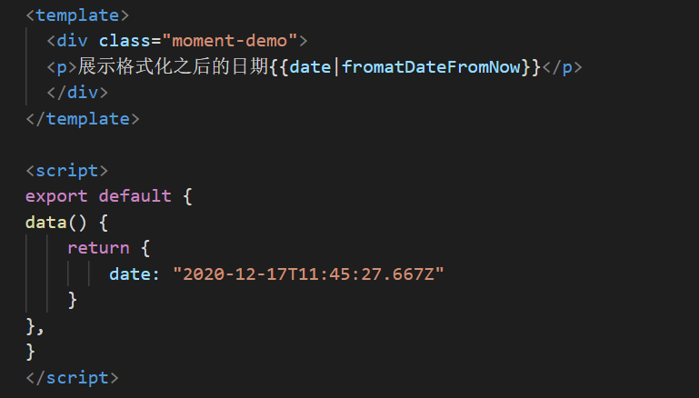

### vue

属于单页面应用(SPA)

#### 如何开始一个 vue 项目

我们以后工作中 Vue 开发模式都是属于 node 项目开发模式。由于 Vue 框架本身非常复杂，需要各种工具包，需要搭建一个 Vue 的开发环境。
对于新手来说搭建一个 vue 的开发环境非常难，但是官方提供了一个非常不错的脚手架(cli)。

- 安装脚手架工具 cli ,在命令行执行 "npm install -g @vue/cli" 全局脚手架(百度 vue.js -> 起步 -> 安装 -> Vue CLI 的文档 -> 转中文->安装->"npm install -g @vue/cli" )
  在命令行工具内 输入'vue ui"
- 第一种 vue ui 创建
- 第二种 输入命令行"vue create vue-hello" 然后敲回车选择版本,结束后输入命令行 'cd vue-hello','npm run serve' 复制地址。

#### vue 项目默认的目录结构

- node_modules 所有的基础依赖,以后通过 npm 下载的所有的包也会放到这。
- README.md 项目介绍文件
- package.json node 项目的标志性文件
- package-lock.json 项目安装的所有包的记录
- babel.config.js babel 的配置文件.
- gitignore 如果该项目是 git 仓库,那么.gitignore 内声明的文件以及文件夹就不会上传到 git. 该文件就是 git 仓库忽略上传的文件
- public 文件夹,里面放的是单页面应用的 html 模版
- src 文件夹 vue 项目源代码
- assets 文件夹
- components 文件夹
- App. vue
- main.js 项目的入口文件

### vue 的基础知识

#### 组件

.vue 后缀的就是 vue 组件,以后也有其他形式的组件。组件其实就足个 html 内的结构
.vue 组件的构成

- template 标签
- script 标签可以没
- style 标签可以没有

template 标签基本和以前的 html 非常像。一个 template 内只能有个子级。
script 标签,一般必须默认导出一个对象,对象下有一个 name 属性属性值和组件名一样
style 标签给组件写样式
App. vue 组件是项目最大的组件,因为只有 App 组件会被渲染到页面上的#app 中

#### 如何划分组件

#### 组件的嵌套

1. 父组件导入需要展示的子组件。
2. 在父组件中的 script 标签内的导出对象下，使用 component 是属性，进行子组件注册。

#### 模板语法

其实就是如何在 template 中使用 js.

1. 在开始标签和结束标签之间使用，需要使用双花括号语法。
   例如：

```html
<p>{{imgTitle}}</p>
```

2. 当作属性的属性值使用。需要使用 vue 的指令 v-bind

- 当一个属性的属性值出现 js 变量的时候需要使用 v-bind： 指令包裹这个属性。
  src 属性经过指令包裹之后引号内可以直接写 js
  v-bind: 指令可以省略为 :
  例如：

```html

```

#### Prop

#### 大概步骤：1 父组件传递数据给子组件，2.子组件在 script 内的导出对象内使用 props 属性接收，3.在子组件 template 内使用

用来实现简单的组件复用，子组件在父组件中出现的时候，需要展示的内容，可以让父组件提供。
实现 prop

- 在父组件内传递相应的数据给子组件，直接在子组件的标签上当做属性传递数据。
- 子组件获取父组件传递的数据展示,需要在子组件的 script 内的导出对象内使用 props 属性接收。
  - 接收方式有很多。
  1.  数组方式接收。
      例如：

```js
     <script>
export default {
  name: "Box",
  props:["imgTitle"]
  数组里面写字符串，字符串的名字与父组件设置的属性名相同。
  这样 imgTitle 就接收了父组件传递的相应的数据，这个数据可以认为是一个该组件内的全局变量随意使用。
};
</script>
```

- props 的验证 类型 检查
  接收 prop 的时候需要使用对象形式。 ..........

##### prop data method ....的使用(在 template script 标签中)

1. 在 template 中使用，需要遵循 vue 的模板语法。
2. 在 script 需要使用 this.xxx xxx 表示对应的名字

- 如果 data 和视图没有关系，那么修改的时候对用的生命周期不会执行。

##### <Content/> 组件是一个比较大的组件内部有很多样式,只有内的内容展示不一样,并不是文字不一样,而是标签不一样,有时候可能展示 p 有时候 h

- 实现方法 1:(不推荐使用)
  父组件

```html
<template>
  <div class="left">
    <content htmlStr="<p>展示的内容</p>" />
    <content htmlStr="<h2>展示的内容</h2>" />
  </div>
</template>
```

当 template 想要解析 html 字符串的话需要使用 v-html 指令

子组件

```html
<template>
  <div
    class="content"
    v-html="htmlStr(这里的值是props属性里对应想要展示的值)"
  ></div>
</template>
```

- 实现方法 2：
  父组件
  将需要展示的不同 html 结构写在组件的开始标签和结束标签之间

* 这种传递 prop 的方式叫做 slot (插槽)

```html
<template>
    <div class="left">
        <Content><p>展示的内容</p><Content/>
         <Content><h2>展示的内容</h2><Content/>
    </div>
</template>
```

子组件

```html
<template>
  <div class="content">
    父组件传递的Prop 属性不需要在子组件的script 接收。 父组件传递的 slot prop
    直接使用slot 标签使用；
    <slot />
  </div>
</template>
```

#### data 组件的数据(或者叫状态（state）)

vue 内如果想要视图(页面)发生改变(比如购车的数字变了轮播图换图了,. ...,样式能处理的不算),那么必须由组件的 data 直接或者间接控制数据
data 数据

- 数据变引起视图改变三大步骤: 1.创建 data 2.将 data 展示到视图上 3.修改 data ---> 事件处理：
  (1). 定义事件(data 函数外添加 methods 属性，该属性的属性值是对象，在该对象内定义事件)
  (2). 绑定事件(在 template 标签内的对应 HTML 结构里通过 v-on：指令绑定事件 该指令可以简写成 @ )
  (3).事件传参 事件绑定的时候直接传递即可，父组件使用@xxx="xxx",子组件在 template 中直接使用@click="$emit('xx')"

```html
<li
  @click="changeActiveIndex(num-1)"
  :class="{active: activeIndex === num-1}"
  v-for="num in imgArr.length"
  :key="num"
></li>
```

```js
 methods: {
    changeActiveIndex(index) {
      this.activeIndex = index;
    }
    }
```

(4).事件函数内获取事件对象，如果绑定函数没有传递额外的参数，那么事件的第一个参数默认就是事件对象
如果绑定函数的时候传递了参数，那么事件内想要使用事件对象的话，绑定的时候使用 $event 当作实参传递使用。

```html
<li
  @click="changeActiveIndex(num-1,$event)"
  :class="{active: activeIndex === num-1}"
  v-for="num in imgArr.length"
  :key="num"
></li>
```

```js
 methods: {
    changeActiveIndex(index,e) {
      console.log(e)
      this.activeIndex = index;
    }
    }
```

(5).事件简写如果事件内只是修改了 data 的值，可以直接写在在 tamplate 中：@click="activeIndex === num - 1"
例如：

```html
<template>
  <header>
    <h2>我是头部</h2>
    <span>{fcount}}</span>
    <br />
    使用v-on:指令绑定事件 template中使用script内的内容的时候基本上都是直接使用
    template中指令后面的引号内都可以直接写js
    <button v-on:click="add">+</button>
    <button>-</button>
  </header>
</template>
```

```js
<script>
export default{name: Header,
//  data必须是一个函数,并且返回一个对象,对象下的属性就是data数据
//  data的使用和我们介绍的prop的基本和使用一致
 data(){
     return {
         count: 1000
     }
     //事件处理函数
     methods: {
    //这里面写的方法就可以当做事件处理函数使用
    add(){
    // console.log('我是加法/修改data直接修改即可
    this.count = this.count + 1
    }
  }
 }
 </script>
```

#### 让一个元素出现和消失。(3.11)

- 让一个元素消失
  分为两大类： 结构消失 、样式消失
  (1)结构消失
  1.remove
  2.removechild
  (2)样式消失 1. visibility: hidden; 2. display:none;
  3.opacity:0;
  4.overflow: hidden;
  width:0;
  height:0;

### 样式的消失出现

#### class 与 style 的绑定

同样是三大步骤：1.创建 data ---> 2.将 data 展示到视图上 ---> 3.修改 data
<1--将 show 这个 data 和 box 的 class 挂钩-->

##### class 绑定

1. 普通的 js 语法实现
2. 对象语法
3. 数组语法,数组语法可以嵌套对象语法

一、让你一元素消失出现

```html
1. 普通的js语法实现
<div :class="show ? 'btn' : 'btn hide'"></div>
2. 对象语法
<div :class="(btn: true, hide:!state)"></div>
3. 数组语法
<div : class=" ['btn', show?'': hide']"></div>
4. 数组语法嵌套对象语法
<div :class="['btn', { hide: !state }]"></div>
```

##### style 绑定

- vue 中的事件绑定可以直接写在标签上，不一定需要在 methods 内定义，直接写的话，一般只写修改 data 的操作。

```html
例如：<button @click="active = !active">切换背景色</button>
```

二、修改颜色

```html
1. 普通的js语法实现
<div class="btn" :style="`backgroundColor:${active?'red':'#00b3d4'}`"></div>
2. 对象语法
<div class="btn" :style="{backgroundColor:active?'red':'#00b3d4'}"></div>
3.数组语法 数组语法就是使用多个对象语法 [对象语法，对象语法]
<div
  class="btn"
  :style="[{backgroundColor:active?'red':'#00b3d4'}],对象语法..."
></div>
```

#### 通过指令实现样式的出现和消失

- 通过 v-show 指令实现 只是实现出现或消失 添加或者删除 display:none
  同样是三大步骤：

```js
  data(){
    return {
      state:true
    }
  },
  methods:{
    changeShow(){
      this.state = !this.state
    }
  }
```

```html
<button @click="changeShow">切换出现消失</button>
<div class="btn" v-show="state(data值)"></div>
```

### 结构的消失出现

- v-if 、v-else 、 v-else-if
- v-else 与 v-if 同级同时搭配使用。

```html
<div class="btn" v-if="state(data值)">
  <p v-else>我是个小白</p>
</div>
```

#### 条件渲染 v-if vs v-show

v-if 是“真正”的条件渲染，因为它会确保在切换过程中条件块内的事件监听器和子组件适当地被销毁和重建。

v-if 也是惰性的：如果在初始渲染时条件为假，则什么也不做——直到条件第一次变为真时，才会开始渲染条件块。

相比之下，v-show 就简单得多——不管初始条件是什么，元素总是会被渲染，并且只是简单地基于 CSS 进行切换。

一般来说，v-if 有更高的切换开销，而 v-show 有更高的初始渲染开销。因此，如果需要非常频繁地切换，则使用 v-show 较好；如果在运行时条件很少改变，则使用 v-if 较好。
、

#### 列表渲染 (列表渲染就是将数组渲染到页面上)

要根据数据渲染多个 keyword(想要渲染谁就给谁加)
v-for 的使用 word in keyword
word 是自定义的变量名,代表数组内的项 称之为循环的参数还可以有 index 参数就需要写成(word,index)
keyword 是数据数组
使用 v-for 的时候必须添加 key 属性，而且 key 属性的属性值必须是在兄弟之间唯一的

```html
<div class="keywords">
  <div class="keyword" v-for="(word,index) in keywords" :key="index">
    <span>{{`0${index + 1}`}}</span>
    <h4>{{word}}</h4>
  </div>
</div>
```

数字和字符串的 v-for

```html
<p v-for="num in 4" :key="`0${num}`">{{num}}</p>
<p v-for="(str,index) in 'holle'" :key="`${index}0`">{{str}}</p>
```

- 在 template 标签上使用 v-for 可以渲染包含多个元素的内容
  key 是不可以加在 template 标签上的，加在里面元素内，而且最外层的每一个都要添加，还要唯一

```html
<ul>
  <template v-for="item in list">
    <li :key="item.id">{{item.id}}</li>
    <li :key="item.text">{{item.text}}</li>
  </template>
</ul>
```

v-if 往往与 v-for 一起使用

```html
<div v-if="keyword.length" class="keywords">
  <div class="keyword" v-for="(word,index) in keyword" :key="index">
    <p>{{`0${index + 1}`}}</p>
    <h4>{{word}}</h4>
  </div>
</div>
<p v-else>暂时没有数据</p>
```

- vue 本地图片地址输入使用 require(")
- vue 样式格式化

1.

```css
body {
  margin: 0;
}
* {
  box-sizing: border-box;
}
a {
  text-decoration: none;
}
```

2.  引入 main.js 中 直接使用 import ' '

#### vue 组件的生命周期钩子

从组件渲染-->销毁 ，不同的生命周期阶段对应着组件内的不同的生命周期函数，在对应阶段对应的函数会自动触发。

- 初始渲染阶段
  - beforeCreate
    在实例初始化之后，数据观测 (data observer) 和 event/watcher 事件配置之前被调用。
  - created
    data 设置完成，可以修改了。
    可以执行修改 data 的操作，也就是以后的异步请求修改数据可以在此生命周期执行
  - beforeMount
    挂载之前，组件的 render 函数首次执行。
  - mounted
    组件完全渲染到页面中
    可以获取真实的 dom 节点了
    也可以发送请求更新数据
- 数据更新渲染阶段
  - beforeUpdate
    数据更新时
  - updated
    数据更新完，页面跟新也完毕了
    可以获取更新之后的 data 以及真实的 dom 节点
- 销毁：--->通过 v-if 条件渲染 的方式触发组件的销毁
- beforeDestroy
  实例销毁之前调用， 在这一步，实例然然完全可用
- destroyed
  实例销毁调用，对应 Vue 实例的所有指令都被解绑，所有的事件监听器被移除，所有的子实例也都被销毁。

- 在组件的 script 标签内嵌套的函数内想要使用 this(组件本身) 需要将函数定义成箭头函数
- 想要定义一个组件内的全局变量，又不想弄成 data ， 可以直接使用 this.xxx 定义

#### 组件之间的交互

- 子组件接收到的 prop 如果 prop 的类型 是非对象类型，不能直接修改，是对象类型，也不推荐直接修改。
- 父子之间
  - 父组件想要修改子组件的 data 定义到父组件中,然后将其当做 prop 传递给子组件，如果子组件想要修改的话，可以在父组件定义修改的方法，将该方法传递给子组件执行。

#### 自定义函数

父组件传递给子组件，的 prop 如果是一个函数的话，我们可以将这种传递方式换成自定义事件的传递，自定义事件只能传递一次
用法：传递的时候 @close = "close" 前一个 close 是自定义函数的函数名 后一个 close 是传递函数的函数名，
接收的时候 不使用 props 接收，直接使用 $emit('close')  template直接使用执行事件 script 中 需要使用 this.$emit('close',事件参数)

##### 插槽

普通插槽<Dialog>内容</Dialog> ———————> <solt/> 接收
具名插槽 <Dialog><template v-slot:插槽名></template></Dialog> ———————> <solt nama = "插槽名"/> 接收 v-slot 简写成#

#### 表单输入绑定

必须将输入的内容和组件的 data 绑定, 然后使用事件去修改

      handleInput(e){
        this.username = e.target.value
      }

change 事件失去焦点的时候域的内容发生改变
input 事件域的内容发生改变

- vue 提供了一个指令简化表单的输入绑定 v-model
- 如何简化
  1. text ————> value @input
  2. checbox ————> checked @change

* 复选框 必须设置 Value

#### 数组数据如何产生变化

1. 数组的一些方法 push()、pop()、shift()、unshift()、splice()、sort()、reverse()
2. 直接替换数组 arr:[,1,2,3] ---> arr =[1,2,3,4,5]
3. 直接使用 filter 不可以，还需要替换
   以下对数组修改不能引起视图的改变
   @click= “arr[0]=100” 、 @click= “arr.length=1”
   解决方案 @click= “arr.splice(1,1,100)” 、 @click= “arr = arr.slice(0,1)”
   vue 提供的 set 方法解决视图不更新的问题

- template 中写法

```html
@click = “$set(arr,1,100)”
```

- script 中写法

```js
    fun(){
    this.$set(this.arr,1,100)
    }
```

#### 数组数据如何产生变化

```script
post:{
  id: 111,
 title:"vue 学习",
 author:"大黑"
}
```

1. 直接对已存在的属性进行修改 @ckick="post.title = vue 基础"
2. 直接对对象进行赋值 @click="post = {id: 222,title:"vue 基础",author:"小白"}"
3. 添加一个新的属性， 直接新增不会引起视图更新 @click="post.advertisement = true}"
4. 直接对对象进行赋值 @click="post = {...,advertisement:true}"
5. set 实现对象的属性新增 @click="$set(post,advertisement:true)"

#### 计算属性和侦听器

##### 计算属性

计算属性 computed 就是 data 数据的计算数据,另一种 data ，计算之后的 data
计算属性是基于它们的响应式依赖进行缓存的。

```script
computed(){
  return this.carts.reduce((res,item){
    res.total += item.counts*item.price
    res.totalNum += item.counts
    return res
  },{total:0,totalNum:0})
}
```

- 计算属性扩展
  <当直接修改计算属性的时候, 计算的源数据也要跟着改变,那么就必须设置计算属性的 setter，其实计算属性默认就是 getter

计算属性的对象写法：

```script
computed:{
  fullName:{
    get(){
      return this.firstName + "" +this.lastName
    },
    set(newValue){
      const nameArr = newValue.split('')
      this.firstName = nameArr[0]
      this.lastName = nameArr[1]
    }
  }
}
```

- 如果 v-model 的值是 prop 那么直接写的就是可以直接对 prop 修改, 是不推荐的
- 当 prop 是对象的时候,子组件可以直接修改,而且修改了视图也会更新。但是不推荐
- 如果 v-model 的值是 prop 怎么更新, 使用 value 展示个数, 然后绑定 onChange 事件, 事件内传递 id 然后执行父组件内的修改个数函数

##### 侦听器

- 侦听器的作用 是根据一个 data 的变化，去修改另一个 data
- 区分计算属性 1. 计算属性中不能包含异步操作。
- 侦听器的侦听对象 data prop 路由信息

```js
  watch: {

    监听question data 当 question  发生改变的时候,监听事件就会触发，从而可以改变另一个 data
    写法一：函数写法
    question(newValue) {
      setTimeout(() => {
        this.answer = newValue.length > 5 ? "是" : "不是";
      }, 1000);
    }
    写法二：对象写法
    question: {
      handler(newValue) {
        console.log("改变就执行");
        setTimeout(() => {
          this.answer = newValue.length > 5 ? "是" : "不是";
        }, 1000);
      },
    //当监听的数据是对象的时候，想要监听其属性的改变，就需要加 deep;
     deep: false,
    // 当组件出现的时候就需要监听数据更新对用数据就加 immediate
     immediate: false
    }
  }
```

#### 使用 vscode 终端打开 gitbash 命令行工具: 终端 -> 新终端 -> 选择默认的 shell

#### 修饰符

v-model 指令修饰符
lazy 将默认的 input 事件换成 change
Number 修改的时候只能改成数字
trim 去掉 左后空白
v-on 指令修饰符 事件修饰符

1. stop 阻止事件冒泡
2. prevent 阻止事件行为
3. capture 将事件在捕获阶段触发
4. self 事件只有点击自己本身的时候才会触发
5. once 事件只触发一次
   v-on 按键修饰符 键盘事件修饰符 .+按键名
   系统修饰符
   可以如下修饰符来实现仅在按下相应建键是才触发鼠标或者键盘事件的监听器
   exact 修饰符
   鼠标按键修饰符
   left right middle

##### 将对象的所有属性传递

循环的时候 todo 指的是具体的一项,我们需要将其所有内容全部传递给 TodoItem 组件, 选择了传递正个页象:todo='todo'
也可以直接将整个对象下的所有属性次性全部传递 v-bind='todo

```html
<TodoItem
  v-for="todo in todos"
  v-bind="todo"
  key="todo.id"
  @delTodo="delTodo"
  @completeTodo="completeTodo"
/>
```

#### .sync 指令修饰符

这个 data 需要于组件修改,一般做法定在子组件定义好修改的方法,然后传递给子组件执行
也可以使用自定义事件的.sync 修饰符实现,一般只用在非引用类型的 data
.sync 修饰符的用法 不需要在父组件定义修改 data 的方法

```html
这个自定义事件的名称是update:type 传递函数其实是function($event){ type = $event}
<TodoFooter @update:type="type = $event" />
.sync实现缩写 <TodoFooter :type.sync="type" /
```

子组件使用

```html
<button @click="$emit('update:type", 'all')">all</button>
```

让 input 获得焦点
使用 focus 方法让 input 获得焦点
直接使用 focus 方法获得焦点不成功,因为 focus 执行的时候, input 并没有出现
要在 input 更新完毕之后再执行 fous

#### $nextTick

当直接修改了数据之后想要获取对应的更新之后的 dom 节点需要借助 nextTick 方法
this. $nextTick(() =>{})

#### ref

element ui 内有的组件自带一些方法，使用对应的组件可以直接调用，通过 ref 获取组件
document 方式获取真实 dom 节点,需要替换成 ref
vue 中提供了获取真实 dom 节点的方式就是 ref
当给普通的 html 添加 ref 属性时, ref 指的就是 html 节点的真实 dom, 当 ref 属性添加到组件上时 ref 指的就是组件本身
获取 ref 就是使用组件 this.$refs.xx 获取
所以在父组件中给子组件添加 ref 属性,可以在父组件中获取子组件,那么子组件内的所有内容父组件都可以获取了
console.log(document. querySelector(".edit-input")
this.$refs.inputEle.focus()

#### 动态组件

<component :is="currentTabComponent"></component>

### 进入/离开 & 列表过渡

#### css 过渡

使用 transition 包裹需要执行过渡效果的元素,并且需要给 transition 组件传递一个 name 属性, name 属性的属性值,是要和对应的 class 挂钩的
class 都有下 6 种
出现的结束和离开的开始其实就是元素的初始状态基本不需要设置

- (一) 进入 出现 enter

1. v-enter：定义进入过渡的开始状态。在元素被插入之前生效，在元素被插入之后的下一帧移除。
2. v-enter-active：定义进入过渡生效时的状态。在整个进入过渡的阶段中应用，在元素被插入之前生效，在过渡/动画完成之后移除。
   这个类可以被用来定义进入过渡的过程时间，延迟和曲线函数。
3. v-enter-to：2.1.8 版及以上定义进入过渡的结束状态。在元素被插入之后下一帧生效 (与此同时 v-enter 被移除)，在过渡/动画完成之后移除。

- (二) 离开 消失 leave

4. v-leave：定义离开过渡的开始状态。在离开过渡被触发时立刻生效，下一帧被移除。
5. v-leave-active：定义离开过渡生效时的状态。在整个离开过渡的阶段中应用，在离开过渡被触发时立刻生效，在过渡/动画完成之后移除。这个类可以被用来定义离开过渡的过程时间，延迟和曲线函数。
6. v-leave-to：2.1.8 版及以上定义离开过渡的结束状态。在离开过渡被触发之后下一帧生效 (与此同时 v-leave 被删除)，在过渡/动画完成之后移除。

```html
<transition name="fade">
  <div v-show="show1" class="txt">hello</div>
</transition>
```

```css
.fade-enter-active,
.fade-leave-active {
  transition: opacity 0.5s;
}
.fade-enter,
.fade-leave-to {
  opacity: 0;
}
```

#### css 动画

#### npm i(运行依赖) -D(开发依赖)

## vue 的数据库 element PC 端

##### 安装使用

#### button tree menu 的使用

#### element 自定义主题

- 按需引入
- 命令行输入安装「主题生成工具」 npm i element-themex element-theme-chalk -D
  因为我们安装在当前目录下，所以需要执行 node_modules/.bin/et -i 命令，然后出现打钩就算是安装成功了，
  会在项目的根目录生成一个 scss 文件，打开文件修改主题配置，保存，然后在命令行工具输入 node_modules/.bin/et 编译主题
  然后项目的根目录里会出现一个 them 文件夹,然后在 babel.config.js 文件里修改 "styleLibraryName"属性——> "~theme",
  最后从起项目，这样主题就修改好了

## vue de 数据库 mint 手机端

在 vue ui 里搜依赖 mint—ui(运行依赖){命令行用 npm i mint-ui -S 安装},
选择按需引入需要借助 babel-plugin-component(同样在 vue ui 依赖里面搜)，我们可以只引入需要的组件,然后在 babel.config.js
文件里导入

```js
 "plugins": [
   ["component",
    {
      "libraryName": "mint-ui",
      "style": true
    }
  ]
]
```

在 src 文件里新建 plugins 文件夹创建 mint.js 文件,然后在 main.js 文件中引入 mint.js (import "./plugins/mint.js")
然后在 mint 文件里按需引入 mint 组件,首先要把 Vue 引入

```js
// 引入Vue
import Vue from "vue";
// 制作全局组件
Vue.component(Button.name, Button);
// 制作全局指令
Vue.use(InfiniteScroll);
// 制作全局方法
Vue.prototype.$messageBox = MessageBox;
```

然后重启项目开始使用 [mint](https://www.w3cschool.cn/mintui/mintui-g49k35s2.html)

#### 无线滚动 上拉/下拉 图片懒加载

### css 扩展 less sass stylus

- 安装后可以直接使用 在 style 标签上加 lang 属性即可 lang="less"

#### less 安装使用

- 命令行输入 npm i less less-loader@5 -D
  [less 的使用说明](https://less.bootcss.com/)

#### sass 安装使用

- 命令行输入 npm i node-sass sass-loader@8 -D
  [sass 的使用说明](https://www.sass.hk/)

#### stylus 安装使用

- 命令行输入 npm i stylus stylus-loader@3 -D
  [stylus 的使用说明](https://stylus.bootcss.com/)

### Swiper 安装使用

- npm i swiper@5.2.0 vue-awesome-swiper
- src 文件里新建 plugins 文件夹创建 vue-swiper.js 文件，vue-swiper 文件中全局引入 vue swiper 组件

```js
// 全局引入  vue swiper 组件
import Vue from "vue";
import vueAwesomeSwipe from "vue-awesome-swiper";
import "swiper/css/swiper.css";
Vue.use(vueAwesomeSwipe);
```

- 然后在 main.js 文件里引入 vue-swiper

```js
import "./plugins/vue-swiper";
```

新建组件在里面使用
[使用方法](https://www.npmjs.com/package/vue-awesome-swiper)

- vue 使用
  
  [修改 swiper 配置](https://www.swiper.com.cn/api/index.html)

- 原生使用方法
  

#### moment 插件安装使用

- 命令行输入 npm i moment
- src 文件里新建 filters 文件夹创建 index.js 文件，在 index.js 文件中制作全局过滤器

```js
//  vue 全局过滤器
import Vue from "vue";
import moment from "moment";
// 切换语言
moment.locale("zh-cn");
// 格式化时间用的过滤器
Vue.filter("fromatDateFromNow", (dateStr) => {
  console.log(dateStr);
  return moment(dateStr).fromNow();
});
```

制作好以后在 main.js 中引用

```js
// index 也可以省略不写
import "../filters/index";
```

然后创建组件使用

[moment 网站](http://momentjs.cn/)

#### Apache ECharts 安装使用

- 一个基于 JavaScript 的开源可视化图表库

* 命令行输入 npm i echarts
* 在打包环境中使用 ECharts 按需引入 [ECharts 官网](https://echarts.apache.org/zh/index.html)

- 创建 vue 插件使用
